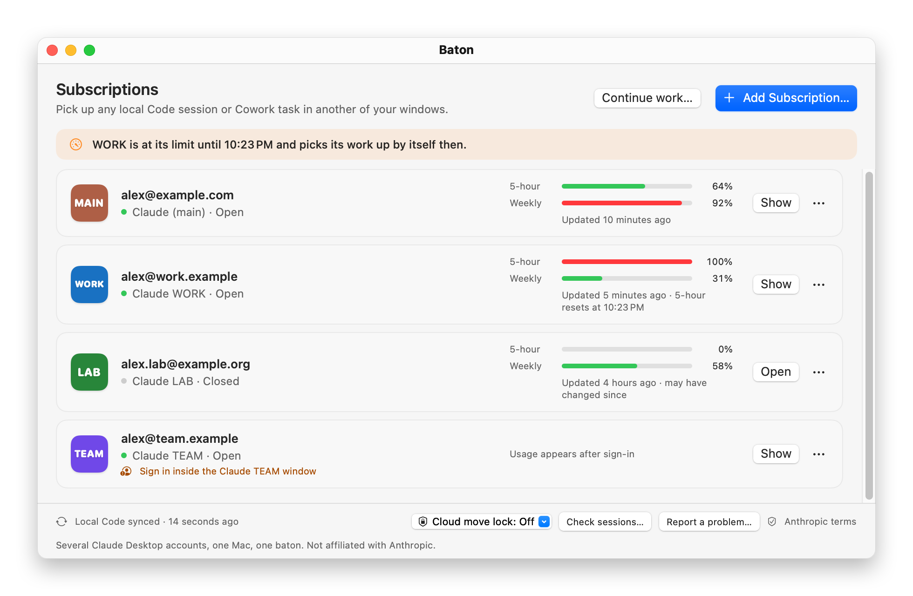
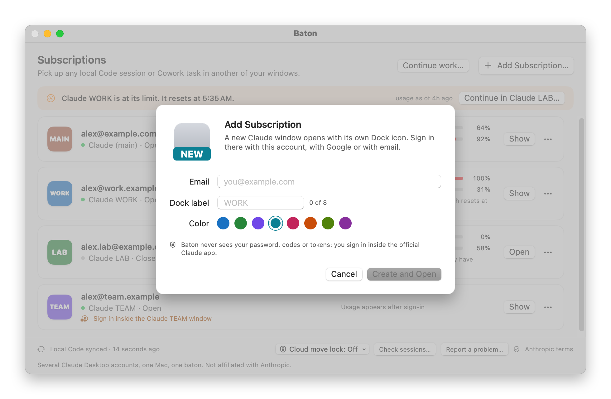
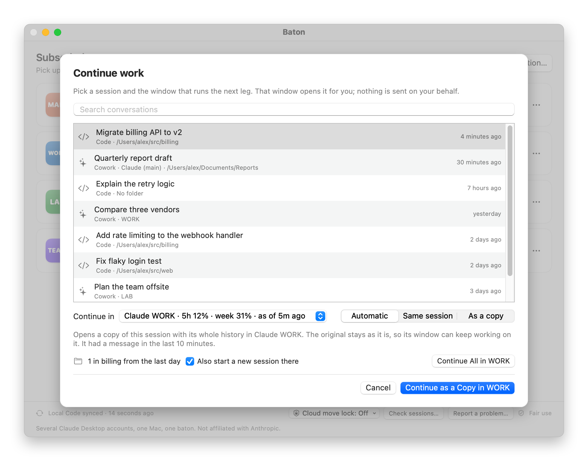
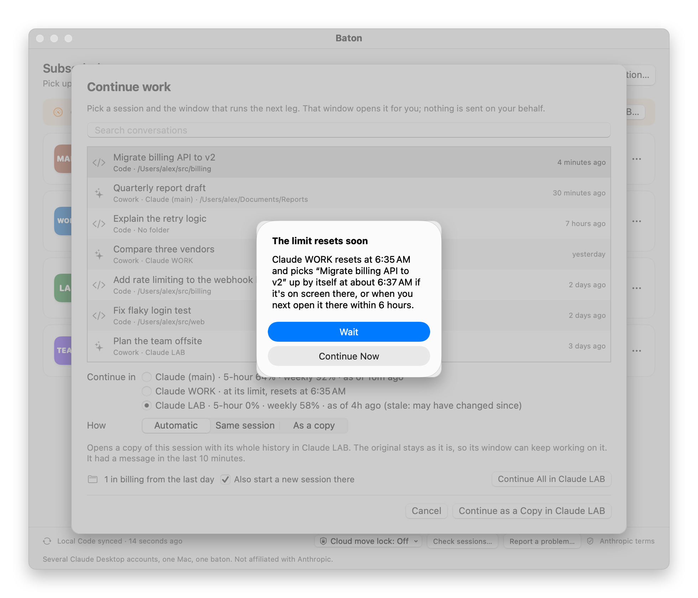

<p align="center">
  
</p>

<h1 align="center">Baton</h1>

<p align="center">
  <b>One Mac, several Claude Desktop accounts, and one baton you pass between your own windows.</b>
</p>

<p align="center">
  <sub>A Mac app for Claude Desktop accounts. Not related to getbaton.dev or to other tools and commands called <code>baton</code>.</sub>
</p>

<p align="center">
  <a href="https://github.com/trukhinyuri/Baton/actions/workflows/ci.yml"></a>
  <a href="https://github.com/trukhinyuri/Baton/releases"></a>
  
  
  
  <a href="LICENSE"></a>
</p>

<p align="center">
  
</p>

Baton runs several Claude Desktop accounts on one Mac, each in its own window of the official Claude Desktop app, and lets you hand a local conversation from one of your windows to another. Think of it as a relay team where every runner is you.

- **One window per subscription.** Each account has its own window, Dock icon and label, so you always know which subscription you're in.
- **Your local work follows you.** Local Claude Code sessions show up in every window. **Continue work…** carries a conversation to another window with its transcript, sub-agents, Workflow history, tool outputs and Rewind checkpoints; a Cowork task continues as a new task with its history and files.
- **Usage in one place.** Each window's five-hour and weekly usage, as Claude Desktop records it, and when a limit resets.
- **Local and careful.** No network code, no credentials read, a dated backup before a session card or settings file is replaced (except Claude's `config.json`, edited in place), and a window's settings changed only while that window is closed. Remote Control is off in Baton's windows by default, with one switch to undo it.

Anything kept in an Anthropic account stays with that account: cloud sessions, Code Projects, claude.ai chats, routines, connectors and Remote Control. Before you continue, Baton names what will not follow.

- [Install](#install) · [Quick start](#quick-start) · [Continue work in another window](#continue-work-in-another-window) · [What follows and what stays](#what-follows-and-what-stays)
- [Limits and resets](#limits-and-resets) · [Local only](#local-only) · [Command line](#command-line) · [Privacy and safety](#privacy-and-safety) · [Staying within Anthropic's terms](#staying-within-anthropics-terms)
- [Report a problem](#report-a-problem) · [Troubleshooting](#troubleshooting) · [Upgrading from Claude Profiles](#upgrading-from-claude-profiles) · [Uninstall](#uninstall) · [Known limitations](#known-limitations) · [FAQ](#faq) · [Why Baton?](#why-baton)

## Install

Requirements: macOS 14 Sonoma or later on Apple silicon or Intel, and [Claude Desktop](https://claude.ai/download) in `/Applications` or `~/Applications`. Coming from Claude Profiles? Read [Upgrading from Claude Profiles](#upgrading-from-claude-profiles) first.

### Download

Baton 1.0.0-rc.1 is a release candidate: it is ad-hoc signed and not notarized yet. The signed 1.0.0 and the Homebrew cask follow.

1. Download `Baton-v1.0.0-rc.1.zip` from [Releases](https://github.com/trukhinyuri/Baton/releases) (it is marked Pre-release) and unzip it.
2. In Finder, drag `Baton.app` to `/Applications` **before you open it the first time**. Opened where it was unzipped, macOS runs it from a temporary copy, and the launchers Baton makes would point into that copy, which is gone after a restart.
3. Open it from `/Applications`. macOS refuses the first time; open **System Settings → Privacy & Security** and click **Open Anyway** next to Baton.
4. If you want the command line, link it from there: see [The `baton` command](#the-baton-command).

To check the download first, use the [GitHub CLI](https://cli.github.com), which fetches the ZIP and its checksum file (keeping a ZIP already in the folder) and verifies the build's provenance. Run it in the folder with the ZIP, or in an empty one:

```sh
gh release download v1.0.0-rc.1 -R trukhinyuri/Baton --skip-existing
shasum -a 256 -c SHA256SUMS.txt
gh attestation verify Baton-v1.0.0-rc.1.zip -R trukhinyuri/Baton
```

Or build it [from source](#from-source) with `make install`: a build you make yourself opens without the **Open Anyway** step.

### Homebrew

From 1.0: the cask arrives with the signed release, and until then this command fails.

Installed the release candidate from the ZIP? Quit Baton and move that `Baton.app` to the Trash first, then run the command: Homebrew won't install over an app it didn't put in `/Applications`. Your profiles and launchers stay. Kept Baton in the Dock? Remove that Dock item too and add the new Baton once it is installed: the old item could still start the copy in the Trash.

```sh
brew install --cask trukhinyuri/tap/baton
```

This installs `Baton.app` in `/Applications` and links the `baton` command. Quit Baton from its menu before you update; your Claude windows can stay open. Coming from Claude Profiles? Then its folder in `~/Applications` keeps the old name until Baton starts with every Claude window closed; see [Upgrading from Claude Profiles](#upgrading-from-claude-profiles).

```sh
brew upgrade --cask baton
```

### From source

You need Xcode 16 or later, or Command Line Tools with Swift 6 (`xcode-select --install`; `swift --version` shows which Swift you have).

```sh
git clone https://github.com/trukhinyuri/Baton.git
cd Baton
make install        # builds Baton.app and copies it to ~/Applications/Baton
```

`make install` stages and verifies the new app before replacing the old one, and keeps the previous app as a ZIP in `AppBackups` in [Baton's data folder](#how-it-works) (the three latest). Your profiles are not touched.

Use one installation (the ZIP, Homebrew or source), not two: two copies would each run their own background sync. The app warns when it finds a second copy.

### The `baton` command

The command-line tool ships inside the app, and Homebrew links it for you. For the ZIP or a build from source, link it into a folder on your `PATH` with the line for your install; `~/.local/bin` needs no admin rights:

```sh
mkdir -p ~/.local/bin
ln -sf /Applications/Baton.app/Contents/Helpers/baton ~/.local/bin/baton              # the ZIP
ln -sf ~/Applications/Baton/Baton.app/Contents/Helpers/baton ~/.local/bin/baton       # make install
```

If the shell then says `command not found: baton`, add the folder to your `PATH` and open a new Terminal window: `echo 'export PATH="$HOME/.local/bin:$PATH"' >> ~/.zprofile`. With admin rights you can link into `/usr/local/bin` instead; a new Apple silicon Mac doesn't have that folder, so run `sudo mkdir -p /usr/local/bin` first and `sudo ln -sf …` there. If macOS blocks the ZIP's `baton` the first time, allow it the same way as the app: **System Settings → Privacy & Security → Open Anyway**.

## Quick start

1. Open **Baton** and click **Add Subscription**.
2. Enter the account's email and, if you like, change the Dock label (`WORK`, `LAB`, `TEAM`) and color.
3. A new Claude window opens. Sign in there with that account, with Google or with email.
4. To keep a profile in the Dock, drag its launcher from `~/Applications/Baton` (**⋯ → Show Launcher in Finder**) to the Dock. Spotlight finds launchers too ("Claude WORK").
5. Pick up any local Code session or Cowork task in another of your windows: click **Continue work…** and choose where it goes next.

<p align="center">
  
</p>

Each row shows the account signed in to that window and its five-hour and weekly usage, as Claude Desktop itself records it; the one with the most headroom is highlighted. Baton stays in the menu bar, where you can open any subscription. App copies are APFS clones that take almost no disk space and are rebuilt automatically after Claude Desktop updates.

> [!IMPORTANT]
> Work in a session from one window at a time. Claude Desktop does not lock sessions across windows.

## Continue work in another window

Click **Continue work…**. It lists the local Code sessions and Cowork tasks of every window, most recent first. Choose one and a subscription to continue in, then click **Continue**; the button names the window, as in **Continue in Claude WORK**. When an open subscription reaches its limit, a banner under the header opens the same sheet ([Limits and resets](#limits-and-resets)). The signed-in subscription with the most room left (by the higher of its five-hour and weekly usage) is preselected, and those at their limit are marked. Usage is only updated while a window is open, so each figure shows its age; one older than 3 hours is marked *may have changed since*.

<p align="center">
  
</p>

| Conversation | What happens in the other window |
|---|---|
| Code session | The same session opens there with its whole history, or a copy of it (below). Sub-agents, Workflow history and tool outputs come with it. A closed window opens first. |
| Cowork task | A new Cowork task opens with a prompt to continue, the full history attached as `history.md`, and copies of the files the task was given and made (up to 10 files, 25 MB each, 50 MB in total). Nothing is sent: review it and send it yourself. The original task stays where it was. |

Before you continue, the sheet lists what will not follow into that account: remote connectors, a Remote Control connection, scheduled tasks and cloud sessions. See [What follows and what stays](#what-follows-and-what-stays).

**Same session or a copy.** Two windows must not write to one session at the same time. **Automatic** therefore continues as a copy a session that a running Claude Code process still has open, or one with a message in the last 10 minutes. A copy is a new session with the same history, sub-agents, Workflow history, tool outputs, file history and scratchpad notes; its title ends with " · from WORK". Other sessions continue as themselves. **Same session** and **As a copy** override this; for a session that may still be written to, **Same session** needs **I closed it** first.

**Continue All in …** continues the six most recent Code sessions of the selected conversation's folder with a message in the last day, in one step, and can also start a new session there. Each one becomes a session in the destination window, so moving a busy folder at once would spend that subscription quickly; continue older ones one by one, or use `--max` on the command line. Each continued session is confirmed by the card Claude imports for it, and one that does not appear is reported rather than counted.

Claude imports every continued session itself, with its usual folder trust and permission checks. A session takes its model from its history; when that differs from the destination's model, the sheet asks you to choose before your first message.

**Folder rules** keep work where it belongs. `baton rule ~/Work/client --only me@example.com` lets the work in that folder, and inside it, continue only in that account; continuing it anywhere else, including a new session there, is refused. The closest folder's rule applies. Work reached through a link in one ruled folder that leads into another takes both folders' rules, so it continues only in an account both allow. Session sharing honors the same rules: a session in that folder does not appear in other accounts' windows. A rules file that cannot be read stops continuing and sharing until it is fixed.

Continuing needs no macOS permissions: the destination window receives a `claude://` link that only that window handles.

### When Claude Desktop forks a session itself

When you open a session that another account started, Claude Desktop may fork it into a new session instead of reopening it. Baton notices the fork at its next sync and brings the sub-agents, Workflow history and tool outputs over to the new session, adding files only; the original session is never changed. **Rewind to a point before such a fork cannot be restored**, because Desktop does not copy the checkpoints into the fork; they remain in the original session. Use **Continue work…**, which keeps them, to move a session yourself.

## Limits and resets

Each row shows the five-hour and weekly usage that Claude Desktop records for that window. A window at its limit says when the limit resets, in your Mac's time format: "resets at 2:10 AM", "resets tomorrow at 2:10 AM", or "resets Wed at about 5:00 AM" when Baton can only estimate it. The times come from Claude itself, from the limit messages in that window's sessions and from Claude's **Auto-continue when limits reset**. They appear for limits reached while Baton is running; one reached before that shows no time. Claude records usage only while a window is open: a closed window gets a new sample about 9 seconds after you open it.

A window counts as free again when its reset time passes, when a newer sample is below the limit, or when Claude answers a request sent in one of its sessions at least a minute after the limit (shown as *Claude answered since*, because extra usage may be what paid for it). An estimate never frees a window. Once a window that was at its limit has stayed free for a minute, Baton says it has room again, in its own window and, if you allow it, as a macOS notification. macOS asks about notifications once; if you decline, the notice stays in Baton's window.

**Auto-continue.** Claude Desktop can continue a session by itself once its limit resets. When you continue such a session in another window, Baton turns off Auto-continue for that one session in the window it left, so the session is not worked on in two windows. It changes only that session's `optedIn` value in the window's `claude_desktop_config.json`, only while that window is closed (at once if it is; otherwise as soon as it closes while the Baton app runs, or when it is next opened from Baton), and after a dated backup. `baton doctor` lists what Baton turned off; to turn it back on, tick **Auto-continue when limits reset** on that session's limit message in Claude. When the window a session came from resets within 15 minutes and would continue it by itself, **Continue work…** and `baton continue` offer to wait instead.

<p align="center">
  
</p>

## What follows and what stays

| | Follows between windows | Stays with the account |
|---|---|---|
| Claude Code | Local sessions with their transcript, sub-agents, Workflow history, tool outputs and, with **Continue work…**, Rewind checkpoints ([except](#when-claude-desktop-forks-a-session-itself) those from before a copy Claude Desktop made itself). Local settings, skills, hooks, memory and MCP definitions in `~/.claude` are shared by every window already. | Cloud sessions, Code Projects with their coordinator, memory and threads, and Project or Remote Control workers. |
| Cowork | Local tasks continue as a new task with their history and files. | The original task and its runtime; cloud Cowork tasks and projects. |
| Chat | Nothing. | claude.ai chats and chat projects. |
| Automation | Nothing. | Routines and scheduled tasks. Local task prompts in `~/.claude/scheduled-tasks` are shared by every window, so give tasks in different windows different names. |
| Connections | MCP servers, extensions and SSH connections defined on this Mac, merged one by one before a window starts. | Connectors, tool approvals, connected folders and Remote Control. |
| Desktop settings | Theme, zoom, language and selected display preferences from the main app, unless you changed them in that window. | Sign-in, account and permission settings, scheduler switches and anything Baton does not recognize. |

Windows signed in to different accounts can show different Claude features. Baton does not copy Claude's feature flags between windows to make them match. For the details see Anthropic's [Code Projects](https://code.claude.com/docs/en/claude-projects), [Remote Control](https://code.claude.com/docs/en/remote-control) and [Cowork architecture](https://support.claude.com/en/articles/14479288-claude-cowork-architecture-overview) pages.

## Local only

**Local only** is on by default. In each window Baton manages, the main one included, it turns off two Remote Control settings: the default for new sessions (`ccRemoteControlDefaultEnabled`) and, where Claude has it, staying reachable (`remoteControlStayReachable`). It writes these keys only while that window is closed, after a dated backup, and records the previous values so turning Local only off restores them. A window that is running shows *pending* and gets the change at its next start.

It deliberately leaves alone local scheduled tasks, waking the Mac for them, web search in Cowork and your permission mode. It never touches managed preferences set by an organization, sign-in data or any server. If you turn Remote Control back on inside Claude, Local only turns it off again at that window's next start, and the window's badge reads *Remote Control on* until then. To keep Remote Control in one window, turn Local only off for that profile.

Optionally, and only after you turn it on, Local only also stops the agent from moving a session to the cloud, with a `permissions.deny` entry in `~/.claude/settings.json`. That file is shared by every window, so this applies to all of them; it cannot hide Claude's own **Move to cloud** button. The **Cloud move lock** menu in Baton's footer shows and changes this switch.

If a Claude Desktop version no longer has one of these settings, the status reads *not supported by this Claude version* and nothing is written.

## Command line

```text
baton list [--json]                 Show every profile, its account and plan usage
baton add <email> [--label TEXT] [--color #RRGGBB]
                                    Create a profile and open it to sign in
baton open <profile>                Open a profile's window (id or label)
baton remove <profile>              Move a closed profile's copy and sign-in to the Trash
baton sync [--dry-run]              Share local Code sessions; inspect Cowork without copying it
baton refresh                       Rebuild app copies and launchers after a Claude Desktop update
baton migrate                       Rename ~/Applications/Claude Profiles to Baton, with Baton quit and
                                    every Claude window closed. Exit 3: kept for now; the printed line
                                    says why
baton doctor [--json]               Read-only session and folder checks
baton local-only on|off [PROFILE|main]
                                    Keep new Claude Code sessions off Remote Control; on by
                                    default. No profile: every window without its own choice
baton local-only status [PROFILE|main] [--json]
                                    Show whether Local only is on in each window, or in one
baton local-only cloud-lock on|off|status
                                    Optional, off by default: also deny the one MCP tool that
                                    moves a Claude Code session to the cloud, Mac-wide, in
                                    ~/.claude/settings.json
baton conversations [--all] [--json]
                                    Recent local Code sessions and Cowork tasks: the 20 most
                                    recent, or with --all every one
baton continue <session|last> --to <profile> [--same [--anyway]|--fork] [--now] [--dry-run]
                                    Continue a conversation in another profile: a Code session
                                    as itself or as a copy, or a new Cowork task with its history
baton continue --folder <path> --to <profile> [--since 24h] [--max 6] [--same [--anyway]|--fork]
               [--new] [--now] [--dry-run]
                                    Continue the Code sessions of a folder with a message since
                                    --since, in one go: the --max most recent (6 unless given);
                                    --new also starts a new session
                                    By default sessions still open in a running Claude Code
                                    process or with a message in the last 10 minutes continue
                                    as a copy; --same keeps the same session (add --anyway once
                                    you've closed it there), --fork copies
                                    If the session's window resets within 15 minutes and
                                    continues it by itself, nothing happens (exit 3) unless --now
baton pass <session|last> --to <profile> [--same [--anyway]|--fork] [--now] [--dry-run]
                                    Same as `continue`
baton rules [--json]                Show which accounts may continue the work in which folders
baton rule <folder> --only <email>[,<email>…] | --remove
                                    Let only these accounts continue work in the folder and
                                    inside it, or drop the folder's rule
baton carry [--dry-run]             Bring sub-agents, Workflow history, tool outputs and the scratchpad
                                    into sessions Claude Desktop continued as a new copy itself
baton report [--save PATH] [--open] Print a redacted problem report; --save writes it to a file,
                                    --open opens a prefilled GitHub issue to review and submit.
                                    Nothing is sent
baton --version                     Print the version and commit
baton <command> --help              Print this help

list, doctor, report, conversations, rules and local-only status never change Claude, its data or
which Claude receives claude:// links.

Exit status: 0 done; 1 failed, and the printed line says why; 2 a command or option baton doesn't
take, and nothing was changed; 3 nothing was done on purpose (continue, migrate), and the printed
line says why.
```

`continue` (or `pass`) takes the start of a session id from `conversations`, or `last` for the most recent one. `--fork` always copies; `--same` keeps the same session but refuses one that may still be written to unless you close it there and add `--anyway`. `--dry-run` prints what would happen, how, and with which model, and changes nothing:

```sh
baton conversations
baton continue last --to LAB
baton continue --folder ~/Projects/api --to LAB --new --dry-run
```

## Privacy and safety

- **No network.** The app has no network code, no telemetry and no update check; Homebrew handles updates. It never calls Anthropic's servers.
- **No credentials.** It never reads, copies or stores passwords, sign-in tokens, cookies or the Keychain. You sign in to each window yourself with Claude's own sign-in. To show the account it reads the account id from `config.json`, the matching email from Claude's local cache, and the usage Claude records locally.
- **No inherited keys.** Before it starts anything, Baton (the app and `baton`) drops every `CLAUDE…` and `ANTHROPIC_…` variable it inherited, so a window opened from a terminal or a Claude Code session starts the way a Dock launch starts it, without an API key, proxy or model override from that shell.
- **Backups first.** Every card it replaces or removes is copied to `Backups/<date>/` in [Baton's data folder](#how-it-works) first, and so is a settings file before Local only or the settings merge replaces it. The one exception is Claude's `config.json`, which holds sign-in data: only its theme, zoom and language keys are edited, in place, and it is never copied. Backup days older than a week move to the Trash; nothing is deleted outright.
- **Closed windows only.** A window's settings and interface stores are changed only while that window is closed, and so is the one Auto-continue value Baton turns off ([Limits and resets](#limits-and-resets)). Sessions are shared with running windows too, but deletions wait until every window is closed.
- **One optional prompt.** The only macOS permission Baton may ask for is to show notifications, the first time a window has room again after a limit. Declining it keeps the notice in Baton's window.
- **Claude's own records stay.** It never writes, edits or removes Claude's history-suppression records, which Claude adds when a session is opened under another account.

Backups can contain MCP definitions and other private setup; keep the application data folder private. Details: [docs/SECURITY-MODEL.md](docs/SECURITY-MODEL.md).

## Staying within Anthropic's terms

Baton is for people who pay for more than one Claude subscription and use each of them themselves. It does not try to get around how Anthropic meters usage:

| Baton does | Baton does not |
|---|---|
| Run the official, Anthropic-signed Claude Desktop app for every subscription (a local copy whose only change is its Finder icon; [details](docs/ARCHITECTURE.md#profiles)) | Patch Claude, inject code or call private APIs |
| Let **you** sign in to each window with the official sign-in | See, store, copy or forward passwords, email codes or OAuth tokens |
| Show usage that Claude Desktop already records locally | Proxy, pool, share or combine limits between accounts |
| Let **you** choose which window to work in | Switch accounts automatically when a limit is reached |
| Keep every subscription separate, each with its own limits | Help anyone share one subscription among several people |

Each subscription keeps its own limits. Use only subscriptions that are yours, and follow Anthropic's [Consumer Terms](https://www.anthropic.com/legal/consumer-terms) and [Usage Policy](https://www.anthropic.com/legal/aup). If your plans come from an employer, check that their policies allow this setup. This is not legal advice.

## Report a problem

Choose **Report a problem** in the app's footer, the menu bar or the Help menu, or run `baton report`. You see the exact text before anything leaves the app, and the app never sends it: **Copy** puts it on the clipboard, **Save…** writes it to a file, and **Open GitHub** opens a prefilled issue in your browser for you to review and submit.

The report contains the versions of Baton, macOS and Claude Desktop, your Mac's architecture, each window's Claude Code version and Local only state, how many windows are open and signed in, the counts from **Check sessions** and the last sync, the last errors shown, and the last 200 lines of Baton's own log (`Logs/baton.log` in its data folder, kept to three files of 1 MB). Your home folder and user name, emails, account and organization ids, profile labels and folder names are replaced with placeholders. Session titles, transcripts and anything that looks like a token are never included. What you type in the description is yours and is not changed.

A report too long for a link opens GitHub with a short summary. The full text is on your clipboard, and the app also saves it in `Reports` in [Baton's data folder](#how-it-works) and shows it in Finder, to paste or attach; `baton report --open` saves it in Downloads unless `--save` says where. Security problems go to a [private advisory](https://github.com/trukhinyuri/Baton/security/advisories/new), not an issue; see [SECURITY.md](SECURITY.md).

## Troubleshooting

**macOS says the app can't be opened, or is damaged.** A build that is not notarized needs one confirmation: move it to `/Applications` first ([Download](#download)), then open **System Settings → Privacy & Security** and click **Open Anyway**. Builds you make yourself with `make install` are not affected.

**A window shows the main account instead of its own.** That window was started without its profile, for example from an icon kept with **Keep in Dock** or reopened by macOS at login. While Baton runs it reopens such a window with its profile; otherwise open it with its launcher or `baton open <profile>`. Keep launchers in the Dock, not the running window's icon.

**Google sign-in finishes in the main Claude app.** While a new window signs in, Baton routes `claude://` links to it and gives them back to the main app once it is signed in, or after 15 minutes. If a link went to the wrong app, close the new window, open it again from Baton and sign in within 15 minutes, or sign in with email.

**A session from another window is missing.** Claude reads its sessions when a window starts. Restart that window, or use **Continue work…**, which opens a session in a running window right away. A folder rule may also keep the session out of that account (`baton rules`). **Check sessions** or `baton doctor` lists what each window has.

**Remote Control came back on.** Local only turns it off again at that window's next start. To keep it on in one window, turn Local only off for that profile.

**After a Claude Desktop update.** App copies are rebuilt the next time each window opens, or now with `baton refresh`. `doctor` warns when your Claude Desktop version is outside the range Baton was tested with, and Local only reports a setting it can no longer find instead of writing it.

**`~/Applications` still has a Claude Profiles folder.** Baton renames it only when every Claude window is closed and Baton itself doesn't run from inside it; see [Upgrading from Claude Profiles](#upgrading-from-claude-profiles). If `~/Applications/Baton` exists as well, Baton uses it, leaves the other folder alone, and **Status…** names both and what to do.

**`baton` runs a different program.** Other tools also install a command called `baton`. `which -a baton` lists every one on your `PATH`, and the first one runs: link Baton's into a folder that comes earlier ([The `baton` command](#the-baton-command)) or call it by its full path. When another `baton` is already in Homebrew's `bin` folder, the cask stops with *It seems there is already a Binary at …*, or, if a formula put it there, leaves that one linked; if you don't need the other program, remove it and install the cask again.

**Building from source fails with stale paths after moving the checkout.** Use a fresh build directory: `BATON_BUILD_DIR=/tmp/baton-build make install`.

Still stuck? [Report a problem](#report-a-problem).

## Upgrading from Claude Profiles

Same app, new name. If you're upgrading from Claude Profiles, your windows, profiles and sessions carry over untouched; only the name on the tin changed. Baton renames its folder in `~/Applications` the next time it starts with every Claude window closed; its data folder keeps the old name, so nothing inside has to move.

- **The command is now `baton`**, and `baton pass` works too. Homebrew links it for you. If you linked `claude-profiles` yourself, that link stops working once the old app is gone; link the new command in its place, here for a link in `/usr/local/bin` ([other places](#the-baton-command)):
  ```sh
  ln -sf ~/Applications/Baton/Baton.app/Contents/Helpers/baton /usr/local/bin/baton
  ```
  With Homebrew the app is `/Applications/Baton.app`. `make install` prints the exact command for every old link it finds.
- **Scripts that still call `claude-profiles`** can keep doing so through the `claude-profiles` link that Baton 1.x keeps inside the app:
  ```sh
  ln -sf ~/Applications/Baton/Baton.app/Contents/Helpers/claude-profiles /usr/local/bin/claude-profiles
  ```
- **`make install`** installs into the folder you already have, renames it to `~/Applications/Baton` when no Claude window is open (or prints the exact command to finish later), and points your launchers at the new app.
- **Installed with Homebrew?** From 1.0, run `brew update && brew upgrade`: the tap's `cask_renames.json` moves the `claude-profiles` cask to `baton`, and Homebrew says it was renamed. Don't install `baton` next to it.
- **Installed from the ZIP?** Quit Claude Profiles and move `Claude Profiles.app` to the Trash. If it was inside `~/Applications/Claude Profiles`, put `Baton.app` in `/Applications` (or run `make install`); otherwise put it where the old app was.
- **Claude Profiles in your Dock?** Once the old app is in the Trash, remove its Dock item and add Baton: the old item could still start it from the Trash.
- **Claude Profiles opens at login?** Replace it with Baton in **System Settings → General → Login Items**. If an older copy still starts, Baton asks it to quit rather than handing over to it.
- **Folder still called Claude Profiles?** Claude windows were open when Baton tried, or Baton runs from inside that folder. Quit Baton, close every Claude window and run `baton migrate`. If `Baton.app` itself is inside that folder, run the copy inside it:
  ```sh
  "$HOME/Applications/Claude Profiles/Baton.app/Contents/Helpers/baton" migrate
  ```
  It exits with 0 once the folder is renamed or there is nothing to do, 3 when the folder has to keep its name for now (the line it prints says why) and 1 on an error. Launchers are updated in place, not rebuilt.

## Uninstall

1. Put back what Baton changed in your main Claude app, while `baton` is still there. Close every Claude window first: these settings change only in a closed window, and a change left pending never happens once Baton is gone.
   ```sh
   baton local-only off main           # restores the main window's Remote Control settings
   baton local-only cloud-lock off     # if you turned the cloud move lock on
   baton doctor                        # lists any Auto-continue Baton turned off
   ```
   For each session `doctor` lists, tick **Auto-continue when limits reset** on its limit message in Claude to turn it back on. For a profile you keep, run `baton local-only off <profile>` too. Without `baton` on your `PATH`, use the one inside the app, such as `/Applications/Baton.app/Contents/Helpers/baton`.
2. In Baton, remove the subscriptions you no longer need (**⋯ → Remove Subscription…**). Their app copies and sign-ins move to the Trash. Keep them if you might reinstall.
3. Remove the app:
   ```sh
   brew uninstall --cask baton         # or: make uninstall
   ```
   From the ZIP, move `/Applications/Baton.app` to the Trash. If you linked the `baton` command yourself ([The `baton` command](#the-baton-command)), remove that link too: `rm ~/.local/bin/baton`, or `sudo rm /usr/local/bin/baton`. It removes only the link; Homebrew removes its own. `brew uninstall --zap --cask baton` also removes the app's preferences, caches and old app copies. None of these removes your profiles (`Profiles/`), their backups (`Backups/`), the launchers, `~/.claude` or Claude's own data.
4. Give `claude://` links back to the main Claude app, in case a profile was signing in when you removed it (use `~/Applications/Claude.app` if Claude is there):
   ```sh
   /System/Library/Frameworks/CoreServices.framework/Frameworks/LaunchServices.framework/Support/lsregister -f /Applications/Claude.app
   ```

To remove everything, including profiles and their sign-ins, move Baton's data folder, `~/Library/Application Support/Baton`, and its launchers folder, `~/Applications/Baton`, to the Trash after step 2. If you upgraded from Claude Profiles, the data folder is `~/Library/Application Support/Claude Profiles`, and the launchers folder may still have that name too.

## Known limitations

- Claude Desktop does not lock sessions across windows. Work in a session from one window at a time.
- Claude reads sessions and interface settings when a window starts, the main window included. New, renamed or archived sessions and changed settings from another window show up after that window restarts.
- What is live stays in the window doing it: which session is running or waiting for you, the Sessions list on the home screen, open panes, terminal tabs and drafts.
- Archive lists are merged: a session archived in any window is archived in all of them, and un-archiving it in one window un-archives it everywhere too.
- Rewind to a point before a fork made by Claude Desktop itself cannot be restored ([why](#when-claude-desktop-forks-a-session-itself)).
- Claude Desktop's local storage formats are not a public API. Run **Check sessions** after updating Claude.

## How it works

A profile is Claude Desktop started with its own `--user-data-dir`, which is standard Electron behavior, from an APFS clone of `/Applications/Claude.app` whose only change is a Finder icon. Local Claude Code transcripts already live in `~/.claude`, which every window reads; Baton shares the small sidebar cards that point to them, between the windows whose accounts may see them.

| What | Where |
|---|---|
| Main Claude app (untouched) | `/Applications/Claude.app`, data in `~/Library/Application Support/Claude` |
| Profile app copies | `~/Applications/Baton/.engines` |
| Launchers you can keep in the Dock | `~/Applications/Baton/Claude <LABEL>.app` |
| Each profile's sign-in and window state | `Profiles/<id>` in Baton's data folder |
| Profile list, folder rules, backups: Baton's data folder | `~/Library/Application Support/Baton`, or `~/Library/Application Support/Claude Profiles` if you upgraded from Claude Profiles |
| Local Claude Code transcripts, settings, skills, memory | `~/.claude`, shared by every window |

The data folder keeps the name it was created with, because Claude's own files and your session history record paths inside it. Only the launchers folder, the one you see in Finder, takes the new name.

More: [architecture](docs/ARCHITECTURE.md), [security model](docs/SECURITY-MODEL.md), [design decisions](docs/adr/), [testing](docs/TESTING.md) and [why this exists](docs/WHY.md).

## FAQ

**Does this combine the limits of my subscriptions?**
No. Each subscription keeps its own usage limits, and Baton does not pool, share or combine them. It only makes it quick to move to another window you are already signed in to.

**Does Baton switch accounts for me when a limit is hit?**
No. Baton never switches accounts for you: you pick the window and click **Continue**. The app shows where there is room and offers to continue there, and nothing moves until you click.

**Does it work with Team or Enterprise seats?**
Technically yes: a profile can sign in to any account. Whether you may use a work seat this way is up to your organization.

**How is Baton different from other Claude Desktop profile tools?**
Other open-source projects also run several Claude Desktop accounts on one Mac. [odahcam/claude-desktop-profiles](https://github.com/odahcam/claude-desktop-profiles) (a Swift app) and [abnegate/claude-multiprofile](https://github.com/abnegate/claude-multiprofile) (a Node command-line tool) give each account its own `--user-data-dir`, as Baton does, and keep each account's conversations to itself. [Disskaette/claude-desktop-profiles-macos](https://github.com/Disskaette/claude-desktop-profiles-macos) switches one Claude Desktop between accounts by swapping its data folder, carries Code sessions across the switch and shows each account's usage. Baton's focus is carrying local work between windows that run at the same time: a session continues in another window with its sub-agents, Workflow history, tool outputs and Rewind checkpoints, folder rules keep work in the accounts it belongs to, and every change is backed up first.

**Why is Remote Control off?**
Remote Control ties a window's sessions to its Anthropic account, and Baton 1.0 covers local work only. We have not confirmed whether Remote Control plays a part when Claude forks or hides a session another account opened; Local only keeps it out of the picture and keeps work on your Mac. Turn it off for a profile that needs Remote Control.

## Why Baton?

In a relay the runner hands the baton to the next one, and the race goes on in good hands. Baton does that between your own Claude windows. It was called Claude Profiles until 1.0; we renamed it to keep "Claude", Anthropic's trademark, out of the product's own name. We say Claude Desktop only to name what Baton works with.

## Contributing

Issues and pull requests are welcome; see [CONTRIBUTING.md](CONTRIBUTING.md) and the [Code of Conduct](CODE_OF_CONDUCT.md). `make test` runs the suite.

## License

[MIT](LICENSE) © Yuri Trukhin

Built by Yuri Trukhin for his own relay of Claude windows. Not affiliated with Anthropic, and not endorsed or sponsored by it. Claude is a trademark of Anthropic, PBC.
